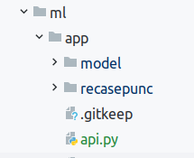

# Запуск ml

1. Перед запуском необходимо скачать модель (выполнять из папки `/app`)
```
./load_data.sh
```
После завершения, должна быть следующая структура:



2. Установить `ffmpeg` и допкодеки
```
apt-get install ffmpeg libavcodec-extra
```
3. Для тестирования:
 - `python api.py` - микросервис с загруженной модель, получает mp_raw_data, на выходе распознанный текст
 - `python process_audio.py` - выполнит парочку запросов к модели


Что найдено в процессе разработки:
- модель VOSK загружается достаточно долго, по этому причине вынесена в отдельный микросервис
- исходные файлы от телеграма `*.wav` не читаются `pydub/AudioSegment.from_file` (ошибок нет, на выходе пустота)
При попытке явно указать формат `format="wav"` вылетает ошибка `ffmpeg` (обновление или установка допкодеков проблему не решает).
По этой причине существует кусок:
```python
    if audio_file_path.split(".")[-1] == 'wav':
        #TODO необходимо, тк *.wav файлы от телеграма по-умолчанию, выдают пустоту
        # ниже выполняется их пересохранение в mp3
        mp3.export(audio_file_path.replace('.wav', '.mp3'), format="mp3")
        mp3 = AudioSegment.from_file(audio_file_path.replace('.wav', '.mp3'))
```
Вообще этот `.wav` - это `.ogg` на самом деле, но и указание формата с установкой `sudo apt install vorbis-tools` - не помогает🤷‍♂️
- лог обработки нескольких файлов доступен тут `src/ml/app/logs/output.logs` - процесс обработки 1 сообщения занимает порядка 10 сек